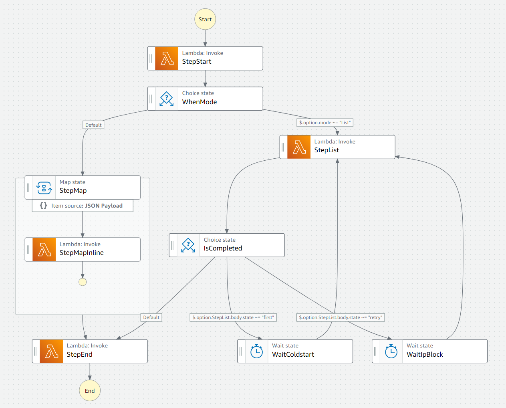

# 소개
kotlin용 각종 도구 모음입니다.
- 간단한 도우미 유틸들
- AWS Client 확장
- AWS CDK DSL 제공
- 구글 / 노션 등의 API 샘플
- Spring / Hibernate 샘플

[](https://opensource.org/license/mit-0/)

## AWS client 샘플

```kotlin
val awsConfig = AwsConfig(profileName = "sin")
val aws = awsConfig.toAwsClient()
aws.lambda.listFunctions { maxItems = 10 }.functions?.map {
    arrayOf(
        it.functionName, it.codeSize, it.functionArn
    )
}?.also {
    listOf("함수명", "코드사이즈", "ARN").toTextGrid(it).print()
}

aws.s3.listBuckets {}.buckets?.map {
    arrayOf(
        it.name, it.creationDate?.toLocalDateTime()?.toKr01()
    )
}?.also {
    listOf("이름", "생성날짜").toTextGrid(it).print()
}

S3Data.parse("s3://sin/athena/3eefab99-5ca7-447f-80c8-93ab1860e25a.csv").let {
    val url = aws.s3.getObjectPresign(it.bucket, it.key)
    println("프리사인 다운로드 url = $url")
}

```


## JSON (Koson/Gson) 샘플
```kotlin
val json = obj {
    "type" to "normal"
    "members" to arr[
            obj { "name" to "A"; "age" to 10; },
            obj { "name" to "B"; "age" to 20; },
    ]
}

val gsonData = GsonData.parse(json)
gsonData["members"].filter { it["name"].str == "B" }.onEach { it.put("age", 25) }

val sumOfAge = gsonData["members"].sumOf { it["age"].long ?: 0L }
println("sumOfAge : $sumOfAge")
```

## AWS CDK DSL with Koin 샘플
```kotlin
XXCdkKoinStarter.startup {
    single { project }
    single { DeploymentType.DEV }
    single { MyVpc.createForKoin() }
}

XX02CoreStack(app, props)

CdkSchedulerGroup {
    this.stack = stack
    this.groupName = "jobSchedule"
    role = MyRole.APP_ADMIN.iRole
    this.dlq = dlq.iQueue
    this.targetArn = iFunction.functionArn
    create()
    schedule {
        name = "job01"
        description = "description..."
        cronExpression = "05 * * * ? *"
    }
}

```


## AWS athena 테이블생성 샘플
```kotlin
val demo = AthenaTable {
    tableName = "demo"
    location = "s3://${bucketName}/collect/event1_job/"
    schema = mapOf(
        "detail-type" to "string",
        "account" to "string",
        "detail" to mapOf(
            "eventId" to "bigint",
            "eventDate" to "string",
            "datas" to listOf(
                "id" to "string",
                "x" to "string",
            ),
        ),
    )
    partition = mapOf(
        "basicDate" to "string",
        "hh" to "string",
    )
    athenaTableFormat = AthenaTableFormat.Json
    athenaTablePartitionType = AthenaTablePartitionType.Index
}
```

## AWS athena 쿼리 샘플
```kotlin

val executions = listOf(
    AthenaExecute("INSERT INTO ... SELECT ..."),
    AthenaReadAll(
        """
                SELECT ..
                FROM ..
                group by  ..
                order by ..
                """
    ) { lines ->
        lines.forEach { println(it) }
    },
    AthenaDownload(
        """
                SELECT ..
                FROM ..
                """
    ) { file ->
        println("파일 다운로드 : ${file.absolutePath}")
        csvReader().open(file) {
            readAllAsSequence().forEach {
                println(it)
            }
        }
        file.toPath().deleteExisting()
    },
)
val athenaModule = AthenaModule(aws)
//모든 쿼리 로직을 동시에 처리 (동시 실행 제한수 주의)
athenaModule.startAndWaitAndExecute(executions)
```

## AWS step function 을 사용한 대용량 분할 처리 실행 인프라(CDK)
```kotlin
CdkSfn(project, "batch_step") {
    this.lambda = func
    this.iRole = role.iRole

    val stepStart = lambda("StepStart")
    val stepEnd = lambda("StepEnd")

    val modeMap = listOf(
        mapInline("StepMap") {
            next = stepEnd.stateId
            itemPath = "$.option.${stepStart.stateId}.body.datas"
        },
        stepEnd,
    ).join()

    val listMode = run {
        val stepList = lambda("StepList")
        val waitColdstart = wait("WaitColdstart") {
            this.secondsPath = "${AwsNaming.option}.${AwsNaming.waitColdstartSeconds}"
        }
        val waitIpBlock = wait("WaitIpBlock") {
            this.secondsPath = "${AwsNaming.option}.${AwsNaming.waitSeconds}"
        }
        listOf(
            stepList,
            choice("IsCompleted").apply {
                whenMatchesBody(stepList.stateId, AwsNaming.choiceFirst, waitColdstart, stepList)
                whenMatchesBody(stepList.stateId, AwsNaming.choiceRetry, waitIpBlock, stepList)
                otherwise(stepEnd)
            },
        ).join()
    }

    create(
        stepStart,
        choice("WhenMode").apply {
            whenMatches("mode", "List", listMode)
            otherwise(modeMap)
        },
    )
    onErrorHandle(adminAllTopic, dlq.iQueue)
}
```


## AWS step function 을 사용한 대용량 분할 처리 실행 샘플
```kotlin
val datas = sample().apply {
    this.chunkSize = 8 * 60
}.datas

val input = executor.startExecution(datas)
val consoleLink = config.consoleLink(input.sfnId)
log.info { "SFN 실행됨 $consoleLink" }
```

### CDK step function 결과



## 전체 모듈 의존관계
